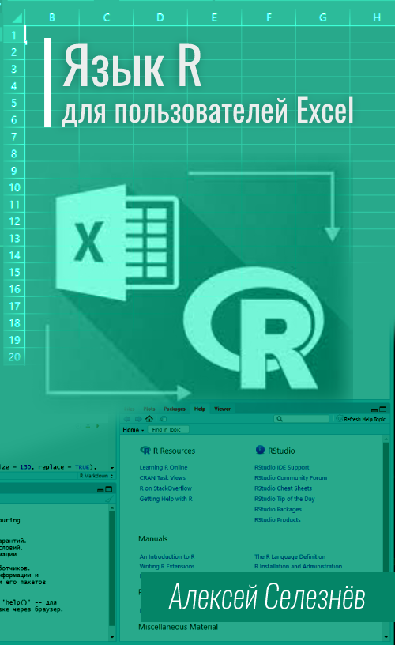

--- 
title: "Язык R для пользователей Excel"
author: "Алексей Селезнёв"
date: "`r Sys.Date()`"
site: bookdown::bookdown_site
output: bookdown::gitbook
documentclass: book
bibliography: [book.bib]
biblio-style: apalike
link-citations: yes
cover-image: "cover.png"
github-repo: "selesnow/r4excel_users"
description: "Бесплатный видео курс по языку R. Введение в tidyverse."
---

# Введение {-}

------

## Предисловие {-}

В связи с карантином многие сейчас львиную долю времени проводят дома, и это время можно, и даже нужно провести с пользой.

В начале карантина я решил довести до ума некоторые проекты начатые несколько месяцев назад. Одним из таких проектов был видео курс "Язык R для пользователей Excel". Этим курсом я хотел снизить порог вхождения в R, и немного восполнить существующий дефицит обучающих материалов по данной теме на русском языке. 

Если всю работу с данными в компании, в котороый вы работаете принято по-прежнему вести в Excel, то предлагаю вам познакомится с более современным, и при этом совершенно бесплатным инструментом анализа данных.

## О курсе {-}

Курс построен вокруг архитектуры `tidyverse`, и входящих в неё пакетов: `readr`, `vroom`, `dplyr`, `tidyr`, `ggplot2`.
Конечно в R есть и другие хорошие пакеты выполняющие подобные операции, например `data.table`, но синтаксис `tidyverse` интуитивно понятен, его легко читать даже неподготовленному пользователю, поэтому я думаю, что начинать обучение языку R лучше именно с `tidyverse`. 

Курс проведёт вас через все операции анализа данных, от загрузки до визуализации готового результата.

Почему именно язык R, а не Python? Потому, что R функциональный язык, пользователям Excel на него перейти легче, т.к. не надо вникать в традиционное объектно-ориентированное программирование.

К каждому из уроков предусмотрен тест. Тест состоит как из теоритических вопросов так и из задач на программирование. Решать тесты или нет лично ваш выбор, но они однозначно помогут вам закрепить полученный в видео лекциях материал. Если вы застряли на какой-то из практических задач можно подсмотреть её решение в [разделе с решениями](-solutions.html).

## Для кого этот курс {-}
Думаю это понятно из названия, тем не менее опишу более подробно. 

Курс ориентирован на тех, кто в работе активно использует Microsoft Excel и там же реализует всю работу с данными. В общем, если вы открываете приложение Microsoft Excel хотя бы раз в неделю то курс вам подойдёт.

Навыков программирования для прохождения курса от вас не требуется, т.к. курс ориентирован на начинающих.

Но, возможно начиная с 4 урока найдётся материал интересный и для активных пользователей R, т.к. основной функционал таких пакетов как `dplyr` и `tidyr` будет рассмотрен достаточно подробно.

## Материалы к курсу {-}
В каждом уроке есть ссылка на папку с материалами, и на каждый отдельный файл, так же в каждом из уроков вы найдёте пример рассмотренного в лекции кода. 

Но, при желании вы можете скачать все материалы курса [одним архивом](https://github.com/selesnow/r4excel_users/archive/52ce5604b653ee0490c299907b7184992d5a5107.zip).

## Об авторе {-}
Меня зовут Алексей Селезнёв, с 2008 года я являюсь практикующим аналитиком. На данный момент основной моей деятельностью является развитие отдела аналитики в агентстве интернет-маркетинга Netpeak.

Мною были разработаны такие R пакеты как: `ryandexdirect`, `rfacebookstat`, `timeperiodsR`, `rvkstat` и некоторые другие. 

Также я являюсь автором курса ["Язык R для интернет-маркетинга"](https://needfordata.ru/r).

Веду свой авторский [Telegram](https://t.me/R4marketing) и [YouTube](https://www.youtube.com/R4marketing/?sub_confirmation=1) канал R4marketing. Буду рад видеть вас в рядах подписчиков.

Периодически публикую статью на различных интернет медиа, зачастую это [Хабр](https://habr.com/ru/users/selesnow/) и [Netpeak Journal](https://netpeak.net/ru/blog/user/publication/826/).

Неоднократно выступал на профильных конференциях по аналитике и интернет маркетингу, среди которых Матемаркетинг, GoAnalytics, Analyze, eCommerce, 8P и прочие.

Начиная с 2016 года всячески стараюсь популяризировать язык R среди русскоязычных аналитиков и маркетологов. Этот курс также был создан с этой целью.

## Программа курса {-}

1. [Устновка R и RStudio]
2. [Основные структуры данных в R и установка и подключение пакетов]
3. [Чтение данных из TSV, CSV, Excel файлов и Google Таблиц]
4. [Фильтрация по строкам, продвинутый выбор столбцов, переименование столбцов, пайплайны][Пакет dplyr: Фильтрация по строкам, продвинутый выбор столбцов, переименование столбцов, пайплайны]
5. [Добавление новых вычисляемых столбцов][Пакет dplyr: Добавление новых вычисляемых столбцов, mutate, mutate_if, mutate_at, mutate_all]
6. [Группировка и агрегация данных][Пакет dplyr: Группировка и агрегация данных, group_by, summarise]
7. [Вертикальное и горизонтальное объединение таблиц][Пакет dplyr: Вертикальное и горизонтальное объединение таблиц, join, bind]
8. [Оконные функции в R][Оконные функции в R][Пакет dplyr: Вертикальное и горизонтальное объединение таблиц, join, bind]
9. [Вращение таблиц или аналог сводных таблиц R][Пакет tidyr: Преобразование таблиц из широкого формата в длинный и наоборот, pivot_longer, pivot_wider]
10. [Загрузка данных из JSON файлов в R и преобразование списков в таблицы][Пакет tidyr: Работа с вложенными столбцами, unnest_longer, unnest_wider]
11. [Простейшая визуализация данных, пакет ggplot2 и функция qplot()][Пакет ggplot2: Быстрая визуализация данных с помощью ggplot2 и функции qplot]
12. [Построение графиков в R слой за слоем с помощью ggplot2][Пакет ggplot2: Построение графиков слой за слоем в ggplot2]
13. [Изменение элементов графиков и применение готовых тем в ggplot2][Пакет ggplot2: Применение тем и изменение элементов графика в ggplot2 (ggthemes, ggthemr)]

## Благодарности {-}
Курс, и все сопутствующие материалы предоставляются бесплатно, но если у вас есть желание отблагодарить автора за этот видео курс вы можете перечислить любую произвольную сумму на [этой странице](https://secure.wayforpay.com/payment/r4excel_users).

Либо с помощью кнопки:

  <button type="button" onclick="runWfpWdgt('https://secure.wayforpay.com/button/b9c8a14345975');" style="display:inline-block!important;background:#2B3160 url('https://s3.eu-central-1.amazonaws.com/w4p-merch/button/bg2x2.png') no-repeat center right;background-size:cover;width: 256px!important;height:54px!important;border:none!important;border-radius:14px!important;padding:18px!important;box-shadow:3px 2px 8px rgba(71,66,66,0.22)!important;text-align:left!important;box-sizing:border-box!important;" onmouseover="this.style.opacity='0.8';" onmouseout="this.style.opacity='1';">Оплатить</button>

## Ссылки {-}
+ [Статья о курсе на Хабре](https://habr.com/ru/post/495438/)
+ [Статья о курсе на proglib](https://proglib.io/p/besplatnyy-videokurs-yazyk-r-dlya-polzovateley-excel-2020-04-14)
+ [Плейлист курса на YouTube](https://www.youtube.com/playlist?list=PLD2LDq8edf4pgGg16wYMobvIYy_0MI0kF)
